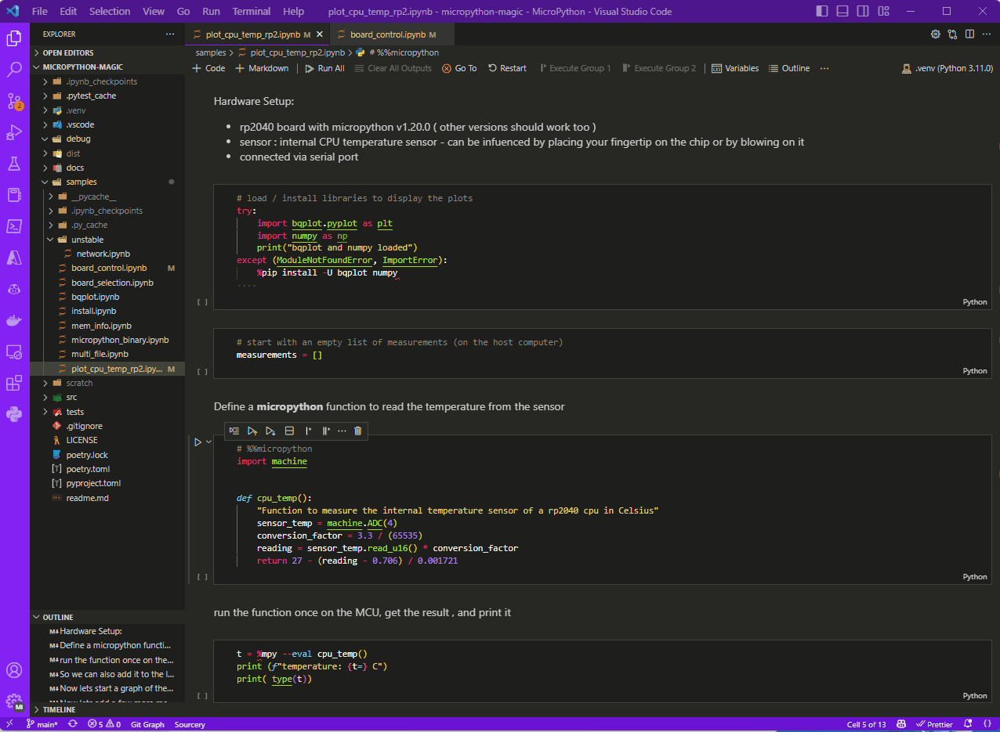
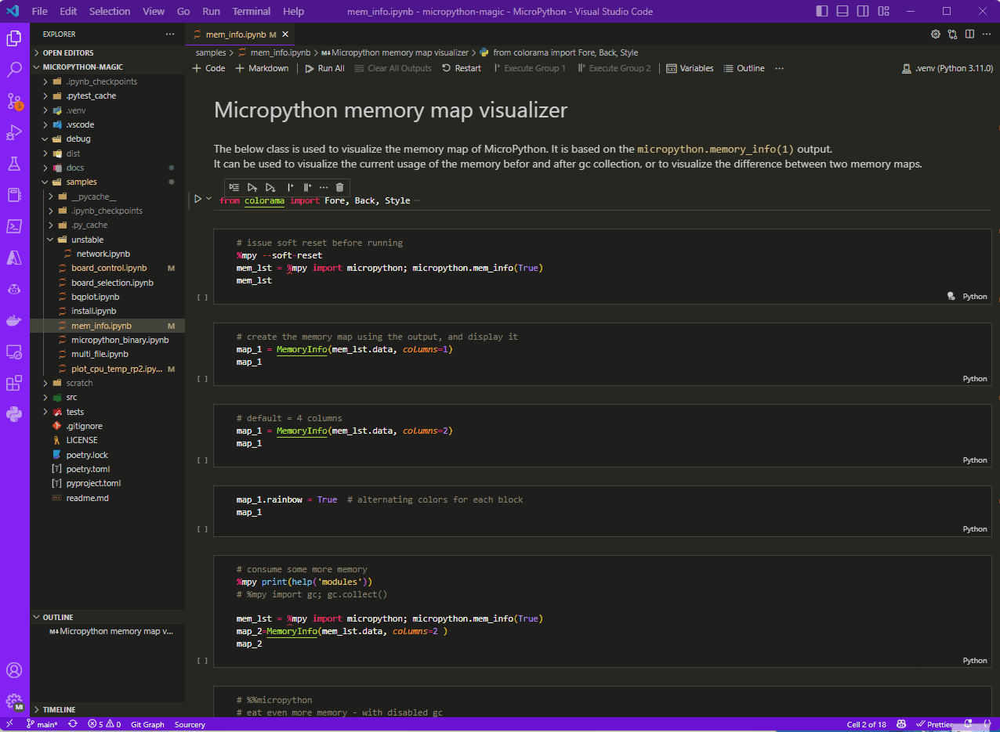
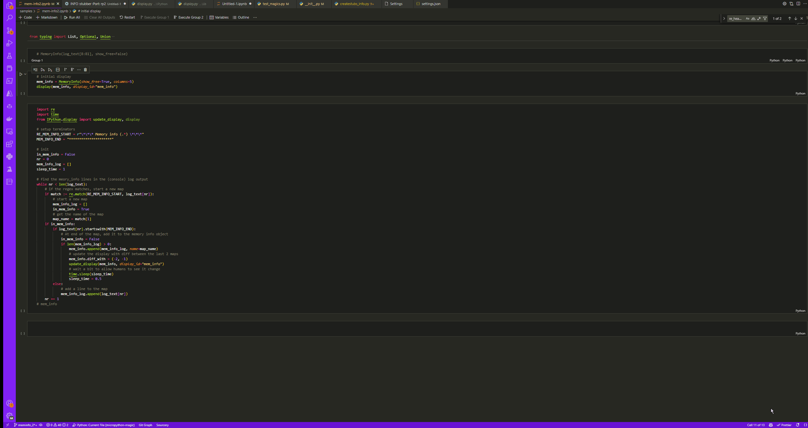

# micropython-magic


These Jupyter magic methods allow MicroPython to be used from within any Jupyter Notebook or JupyterLab (formerly IPython Notebook)
The magics make use of the [mpremote tool](https://github.com/micropython/micropython/blob/master/tools/mpremote/README.md) to enable communication with the MCUs 


This allows: 
 * Mixing of Host and MCU Code ( and languages if you wish)
 * Creating graphs of the data captured by MCU sensors 
 * create re-uasable sequences ( download/compile firmware - flash firmware - uploade code - run expiriment - same outcome) 
 * Create and execute tests that require orchestration across multiple MCUs and hosts 
 * Rapid Prototyping 
 * Capturing the results and outputs of your expiriments in a consistent way
 * Mixing documentation with code  


## A few of the possibilities

<table>

<tr>
<td>
Live Plot of the cpu temperature  


</td>
<td>
Visualize the memory map of the MCU


</td>
</tr>

<tr>
<td>
</td>
<td>
Memory allocation of the MCU over time


</td>
</tr>
</table>

For the source please refer to the samples folder
## Installation
- create and activate a venv `python3 -m venv .venv`
 - [ ] `pip install -U "micropython-magic"`

- or install directly into your notbook environment/kernel using the '%pip' magic by running
  - [ ] `%pip install -U "micropython-magic"`

Recommended : install stubs for your MCU of choice
- [ ] Install stubs for MicroPython syntax checking `pip install micropython-rp2-stubs` (or your port of choise)

### Docker Backend Support (New!)

**For users without physical hardware**, micropython-magic now supports running MicroPython code in Docker containers:

```bash
# Install Docker support
pip install -U "micropython-magic[widgets]" docker

# Ensure Docker is running
docker --version
```

Use the Docker backend in your notebooks:
```python
# Load the extension
%load_ext micropython_magic

# Run MicroPython in Docker instead of physical hardware
%%micropython --backend docker
print("Hello from MicroPython in Docker!")
import sys
print(f"Running: {sys.version}")
```

**Benefits of Docker Backend:**
- ✅ **No hardware required** - Perfect for learning and development
- ✅ **Consistent environment** - Same MicroPython version across machines  
- ✅ **Easy setup** - Just requires Docker installation
- ✅ **CI/CD friendly** - Can be used in automated testing
- ✅ **Safe experimentation** - No risk of damaging hardware

**Limitations:**
- ❌ No GPIO/hardware access (no `machine` module functionality)
- ❌ No hardware-specific features (WiFi, sensors, etc.)
- ℹ️ Variables don't persist between cells (each execution is independent)

The Docker backend uses the official `micropython/unix:latest` image and is ideal for:
- Learning MicroPython syntax and concepts
- Algorithm development and testing  
- Code validation before deployment to hardware
- Educational environments and workshops

## Usage

**1) Create a notebook**
- install your desired notebook environment:
  - [VScode and the **Juypyter extension**](https://code.visualstudio.com/docs/languages/python#_jupyter-notebooks) ,
  - [Jupyter Notebook](https://jupyter.org/install#jupyter-notebook) 
  - [JupyterLab ](https://jupyter.org/install)

- create a new notebook 

**2) Load the magic**
```python
%load_ext micropython_magic
```
This can also be configured once to always load automatically ( see below)


**3) add a cell with some code to run on the MCU**
```python
# %%micropython  
from machine import Pin
led = Pin(25, Pin.OUT)
led.value(1)
```
The `%%micropython` cell magic will instruct Jupyter to run the code on the connected MCU

**4) enable code highlighting for MicroPython**
```python
%pip install micropython-esp32-stubs==1.20.0.*
# installs the stubs for MicroPython syntax checking (one time install per environment) 
```

```python
# %%micropython  
from machine import Pin
led = Pin(25, Pin.OUT)
led.value(1)
```
This allows for syntax highlighting and code completion of MicroPython code.
Tested in VSCode with
- [Python](https://marketplace.visualstudio.com/items?itemName=ms-python.python) extension
- [Pylance](https://marketplace.visualstudio.com/items?itemName=ms-python.vscode-pylance) extension

## More Examples

Please refer to the [samples folder](samples/) for more examples


1. [install](samples/install.ipynb) - install the magic 
1. [board_control](samples/board_control.ipynb) - basic board control
1. [board_selection.](samples/board_selection.ipynb) - list connected boards and loop through them
1. [device_info](samples/device_info.ipynb) - Get simple access to port, board and hardware and firmware information
1. [**Docker Backend Demo**](samples/docker_backend_demo.ipynb) - 🆕 Run MicroPython in Docker containers (no hardware required)
1. [WOKWI](samples/wokwi.ipynb) - Use MicroPython magic with WOKWI as a simulator (no device needed)
1. [Plot rp2 CPU temp](samples/plot_cpu_temp_rp2.ipynb) - create a plot of the CPU temperature of a rp2040 MCU(bqplot)
1. [Display Memory Map](samples/mem_info.ipynb) - Micropython memory map visualizer
1. [Plot Memory Usage](samples/mem_info-plot.ipynb) - plot the memory usage of a Micropython script running on a MCU over time

<!-- 1. [](samples/mem_info_list.ipynb) - not currently working used to trace the m -->


## Automatically load the magic on startup

In order to automatically load the magic on startup, you can add the following to your `ipython_config.py` file:

- create a ipython profile 
  - `ipython profile create`
  - add the following to the configuration file (`.../.ipython/profile_default/ipython_config.py`)

    ```python
    c = get_config()

    c.InteractiveShellApp.extensions = [
        'micropython_magic'
    ]
    ```
## Configuration options

Configuration can be done via the `%config` magic

```python
%config MicroPythonMagic

    MicroPythonMagic(Magics) options
    ------------------------------
    MicroPythonMagic.loglevel=<UseEnum>
        Choices: any of ['TRACE', 'DEBUG', 'INFO', 'WARNING', 'ERROR']
        Current: <LogLevel.WARNING: 'WARNING'>
    MicroPythonMagic.timeout=<Float>
        Current: 300.0

# example
%config MicroPythonMagic.loglevel = 'TRACE'
```
- loglevel : set the loglevel for the magic ( default WARNING)
- timeout : set the timeout for the mpremote connection ( default 300 seconds - 5 minutes)

## Development and contributions

The most welcome contributions are : 
- Testing on different platforms (OS) but also different Jupyter environments ( Jupyter Notebook, JupyterLab, VSCode)
- Provide additional sample notebooks 
- Help add documentation (preferably in a notebook or .md file)
- Share this with other people that may be interested in this.

[See current status](development_status.md) and on Github
